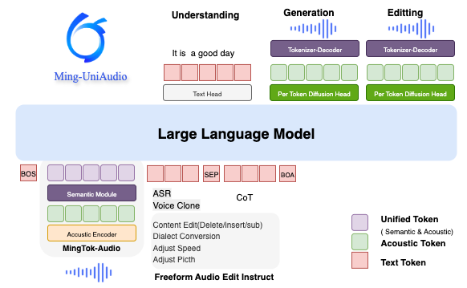

# Ming-UniAudio

<p align="center">
    
<p>

<p align="center">📖<a href="https://xqacmer.github.io/Ming-Unitok-Audio.github.io/">Project Page</a> ｜🤗 <a href="https://huggingface.co/inclusionAI/Ming-UniAudio-16B-A3B">Hugging Face</a>｜ 🤖 <a href="https://modelscope.cn/models/inclusionAI/Ming-UniAudio-16B-A3B">ModelScope</a>


## Introduction

Ming-UniAudio is a novel framework that unifies speech understanding, generation, and editing. Its core is a unified continuous speech tokenizer that effectively unifies semantic and acoustic features within an end-to-end model. We developed a speech language model that strikes a balance between generation and understanding capabilities based on the unified continuous audio tokenizer. Leveraging this foundational model, which exhibits robust performance in both domains, we further trained a dedicated speech editing model built upon [Ming-Lite-Omni](https://github.com/inclusionAI/Ming). Crucially, Ming-UniAudio is the first to enable universal, free-form speech editing guided solely by natural language instructions, handling complex semantic and acoustic modifications without manual region specification.

- 🔥 First unified continuous speech tokenizer for both understanding and generation tasks: [MingTok-Audio](https://github.com/inclusionAI/MingTok-Audio)
- 🔥 First Speech LLM  with unifed continuous tokenizer for both understanding and generation: [Ming-UniAudio](https://huggingface.co/inclusionAI/Ming-UniAudio-16B-A3B)
- 🔥 First universal free-form speech editing model for various semantic and acoustic editing task without any temporal regime: [Ming-UniAudio-Edit](https://huggingface.co/inclusionAI/Ming-UniAudio-16B-A3B-Edit)
- 🔥 First benchmark for free-form speech editing: [Ming-Freeform-Audio-Edit-Benchmark](https://huggingface.co/datasets/inclusionAI/Ming-Freeform-Audio-Edit-Benchmark)

<p align="center">
    
<p>

## 📌 Updates

* [2025.09.30] 🔥 We release [Ming-UniAudio](https://xqacmer.github.io/Ming-Unitok-Audio.github.io/) with significant improvements across speech understanding, generation, and free-form editing tasks.


## Key Features
Ming-UniAudio features key optimizations as follows, compared to other audio-assisted LLMs:
- **Unified Continuous Speech Tokenizer**: Ming-UniAudio proposes a unified continuous speech tokenizer [MingTok-Audio](https://github.com/inclusionAI/MingTok-Audio) based on a VAE framework with a causal Transformer architecture, the first continuous speech tokenizer to effectively integrate semantic and acoustic features, and enables a closed-loop system with LLMs through hierarchical feature representations, makes it suitable for both understanding and generation tasks
<p align="center">
    
<p>

- **Unified Speech Language Model for Generation and Understanding**: We pretrain an end-to-end unified speech language model with a single LLM backbone for both understanding and generation tasks, enhanced with a Diffusion Head to ensure high-quality speech synthesis.
- **Instruction-Guided Free-Form Speech Editing**: We introduce the first instruction-guided, free-form speech editing framework that supports comprehensive semantic and acoustic edits without requiring explicit edit regions, along with [Ming-Freeform-Audio-Edit](https://github.com/inclusionAI/Ming-Freeform-Audio-Edit), the first open-source evaluation set for such tasks.


<!-- <p align="center">
    
<p> -->

##  Evaluation
In various benchmark tests, Ming-UniAudio demonstrates highly competitive results compared to industry-leading models of similar scale.


### Speech Tokenizer
<table>
<caption>Comparison of reconstruction performance across different acoustic tokenizers. The best results are in  <strong>bold</strong>.</caption>
  <thead>
    <tr>
      <th rowspan="2" align="left"><b>System</b></th>
      <th rowspan="2" align="center"><b>FrameRate</b></th>
      <th colspan="3" align="center"><b>SEED-ZH</b></th>
      <th colspan="3" align="center"><b>SEED-EN</b></th>
    </tr>
    <tr>
      <th align="center"><b>PESQ↑</b></th>
      <th align="center"><b>SIM↑</b></th>
      <th align="center"><b>STOI↑</b></th>
      <th align="center"><b>PESQ↑</b></th>
      <th align="center"><b>SIM↑</b></th>
      <th align="center"><b>STOI↑</b></th>
    </tr>
  </thead>
  <tbody>
    <tr>
      <td align="left">MiMo-Audio-Tokenizer</td>
      <td align="center">25</td>
      <td align="center">2.71</td>
      <td align="center">0.89</td>
      <td align="center">0.93</td>
      <td align="center">2.43</td>
      <td align="center">0.85</td>
      <td align="center">0.92</td>
    </tr>
    <tr>
      <td align="left">GLM4-Voice-Tokenizer</td>
      <td align="center">12.5</td>
      <td align="center">1.06</td>
      <td align="center">0.33</td>
      <td align="center">0.61</td>
      <td align="center">1.05</td>
      <td align="center">0.12</td>
      <td align="center">0.60</td>
    </tr>
    <tr>
      <td align="left">Baichuan-Audio-Tokenizer</td>
      <td align="center">12.5</td>
      <td align="center">1.84</td>
      <td align="center">0.78</td>
      <td align="center">0.86</td>
      <td align="center">1.62</td>
      <td align="center">0.69</td>
      <td align="center">0.85</td>
    </tr>
    <tr>
      <td align="left">XY-Tokenizer</td>
      <td align="center">12.5</td>
      <td align="center">2.27</td>
      <td align="center">0.77</td>
      <td align="center">0.90</td>
      <td align="center">2.14</td>
      <td align="center">0.82</td>
      <td align="center">0.90</td>
    </tr>
    <tr>
      <td align="left">Mimi</td>
      <td align="center">75</td>
      <td align="center">2.05</td>
      <td align="center">0.73</td>
      <td align="center">0.89</td>
      <td align="center">2.01</td>
      <td align="center">0.77</td>
      <td align="center">0.89</td>
    </tr>
    <tr>
      <td align="left">XCodec2.0</td>
      <td align="center">50</td>
      <td align="center">2.19</td>
      <td align="center">0.80</td>
      <td align="center">0.92</td>
      <td align="center">2.37</td>
      <td align="center">0.82</td>
      <td align="center">0.93</td>
    </tr>
    <tr>
      <td align="left">BigCodec</td>
      <td align="center">80</td>
      <td align="center">2.26</td>
      <td align="center">0.81</td>
      <td align="center">0.92</td>
      <td align="center">2.22</td>
      <td align="center">0.80</td>
      <td align="center">0.91</td>
    </tr>
    <tr>
      <td align="left"><strong>MingTok-Audio(ours)</strong></td>
      <td align="center">50</td>
      <td align="center"><b>4.21</b></td>
      <td align="center"><b>0.96</b></td>
      <td align="center"><b>0.98</b></td>
      <td align="center"><b>4.04</b></td>
      <td align="center"><b>0.96</b></td>
      <td align="center"><b>0.98</b></td>
    </tr>
  </tbody>
</table>


### Speech Understanding

<table>
  <caption>ASR performance comparison on various audio benchmark datasets. The best results are in <strong>bold</strong>.</caption>
  <thead>
    <tr>
      <th rowspan="2"><strong>Datasets</strong></th>
      <th rowspan="2"><strong>Model</strong></th>
      <th colspan="7"><strong>Performance</strong></th>
    </tr>
    <tr>
      <th><strong>aishell2-ios</strong></th>
      <th><strong>LS-clean</strong></th>
      <th><strong>Hunan</strong></th>
      <th><strong>Minnan</strong></th>
      <th><strong>Guangyue</strong></th>
      <th><strong>Chuanyu</strong></th>
      <th><strong>Shanghai</strong></th>
    </tr>
  </thead>
  <tbody>
    <tr>
      <td rowspan="4"><strong>Understanding ASR</strong></td>
      <td>Kimi-Audio</td>
      <td><strong>2.56</strong></td>
      <td><strong>1.28</strong></td>
      <td>31.93</td>
      <td>80.28</td>
      <td>41.49</td>
      <td>6.69</td>
      <td>60.64</td>
    </tr>
    <tr>
      <td>Qwen2.5 Omni</td>
      <td>2.75</td>
      <td>1.80</td>
      <td>29.31</td>
      <td>53.43</td>
      <td>10.39</td>
      <td>7.61</td>
      <td>32.05</td>
    </tr>
    <tr>
      <td>Qwen2 Audio</td>
      <td>2.92</td>
      <td>1.60</td>
      <td>25.88</td>
      <td>123.78</td>
      <td>7.59</td>
      <td>7.77</td>
      <td>31.73</td>
    </tr>
    <tr>
      <td><strong>Ming-UniAudio-16B-A3B(ours)</strong></td>
      <td>2.84</td>
      <td>1.62</td>
      <td><strong>9.80</strong></td>
      <td><strong>16.50</strong></td>
      <td><strong>5.51</strong></td>
      <td><strong>5.46</strong></td>
      <td><strong>14.65</strong></td>
    </tr>
  </tbody>
</table>


<table>
  <caption>Context ASR performance comparison on various audio benchmark datasets.</caption>
  <thead>
    <tr>
      <th rowspan="2"><strong>Datasets</strong></th>
      <th rowspan="2"><strong>Model</strong></th>
      <th colspan="4"><strong>Performance</strong></th>
    </tr>
    <tr>
      <th>
        <strong>Speech-English</strong><br>
        <small><strong>WER | NE-WER | NE-FNR</strong></small>
      </th>
      <th>
        <strong>Dialogue-English</strong><br>
        <small><strong>WER | NE-WER | NE-FNR</strong></small>
      </th>
      <th>
        <strong>Speech-Mandarin</strong><br>
        <small><strong>WER | NE-WER | NE-FNR</strong></small>
      </th>
      <th>
        <strong>Dialogue-Mandarin</strong><br>
        <small><strong>WER | NE-WER | NE-FNR</strong></small>
      </th>
    </tr>
  </thead>
  <tbody>
    <tr>
      <td rowspan="7">
        <strong>Understanding</strong> <br> 
        <strong>Context ASR</strong><br>
      </td>
      <td>Qwen2-Audio</td>
      <td>11.49 | 27.27 | 35.08</td>
      <td>13.99 | 33.02 | 32.92</td>
      <td>9.92 | 24.10 | 30.02</td>
      <td>7.00 | 22.76 | 26.17</td>
    </tr>
    <tr>
      <td>Baichuan-Audio</td>
      <td>7.52 | 5.87 | 4.55</td>
      <td>5.66 | 10.01 | 3.64</td>
      <td>2.16 | 6.65 | <strong>2.35</strong></td>
      <td>2.96 | 11.48 | 3.94</td>
    </tr>
    <tr>
      <td>Kimi-Audio</td>
      <td><strong>2.90</strong> | 6.68 | 8.01</td>
      <td><strong>4.67</strong> | 13.50 | 11.31</td>
      <td>1.95 | 11.13 | 15.28</td>
      <td>2.90 | 15.91 | 16.68</td>
    </tr>
    <tr>
      <td>Baichuan-Omni-1.5</td>
      <td>8.16 | 7.69 | 6.53</td>
      <td>9.91 | 14.40 | 5.54</td>
      <td>2.98 | 8.39 | 4.71</td>
      <td>5.00 | 16.83 | 7.84</td>
    </tr>
    <tr>
      <td>Qwen2.5-Omni-3B</td>
      <td>3.99 | 7.80 | 9.69</td>
      <td>4.83 | 14.36 | 12.85</td>
      <td>2.13 | 10.55 | 14.11</td>
      <td>3.12 | 15.07 | 15.17</td>
    </tr>
    <tr>
      <td>Qwen2.5-Omni-7B</td>
      <td>3.96 | 7.38 | 8.72</td>
      <td>5.32 | 11.83 | 9.24</td>
      <td>1.84 | 9.80 | 12.19</td>
      <td><strong>2.40</strong> | 14.06 | 13.17</td>
    </tr>
    <tr>
      <td><strong>Ming-UniAudio-16B-A3B-Edit(ours)</strong></td>
      <td>4.00 | <strong>3.56</strong> | <strong>3.69</strong></td>
      <td>5.34 | <strong>8.73</strong> | <strong>2.53</strong></td>
      <td><strong>1.58</strong> | <strong>5.98</strong> | 2.40</td>
      <td>3.04 | <strong>9.50</strong> | <strong>1.48</strong></td>
    </tr>
  </tbody>
</table>


### Speech Generation

<table align="center">
<caption>Performance comparison on various audio benchmark datasets. The best results are in  <strong>bold</strong>.</caption>
  <thead>
    <tr>
      <th align="left"><b>Datasets</b></th>
      <th align="left"><b>Model</b></th>
      <th colspan="4" align="center"><b>Performance</b></th>
    </tr>
    <tr>
      <th></th>
      <th></th>
      <th align="center"><b>Seed-zh WER(%)</b></th>
      <th align="center"><b>Seed-zh SIM</b></th>
      <th align="center"><b>Seed-en WER(%)</b></th>
      <th align="center"><b>Seed-en SIM</b></th>
    </tr>
  </thead>
  <tbody>
    <tr>
      <td rowspan="5" align="left" style="vertical-align: middle;"><b>Generation</b></td>
      <td align="left">Seed-TTS</td>
      <td align="center">1.12</td>
      <td align="center"><b>0.80</b></td>
      <td align="center">2.25</td>
      <td align="center"><b>0.76</b></td>
    </tr>
    <tr>
      <td align="left">MiMo-Audio</td>
      <td align="center">1.96</td>
      <td align="center">-</td>
      <td align="center">5.37</td>
      <td align="center">-</td>
    </tr>
    <tr>
      <td align="left">Qwen3-Omni-30B-A3B-Instruct</td>
      <td align="center">1.07</td>
      <td align="center">-</td>
      <td align="center"><b>1.39</b></td>
      <td align="center">-</td>
    </tr>
    <tr>
      <td align="left">Ming-Omni-Lite</td>
      <td align="center">1.69</td>
      <td align="center">0.68</td>
      <td align="center">4.31</td>
      <td align="center">0.51</td>
    </tr>
    <tr>
      <td align="left"><strong>Ming-UniAudio-16B-A3B(ours)</strong></td>
      <td align="center"><b>0.95</b></td>
      <td align="center">0.70</td>
      <td align="center">1.85</td>
      <td align="center">0.58</td>
    </tr>
  </tbody>
</table>


### Speech Editing

<table>
<caption>Performance on various audio benchmark datasets.</caption>
  <thead>
    <tr>
      <th rowspan="2"><strong>Datasets</strong></th>
      <th rowspan="2"><strong>Model</strong></th>
      <th colspan="4"><strong>Performance</strong></th>
    </tr>
  </thead>
  <tbody>
    <tr>
      <th>
        <strong>Deletion-basic<br>
        <strong>Deletion</strong>
      </th>
      <td>Ming-UniAudio-16B-A3B-Edit</td>
      <td align="center">
        <strong>WER(%) zh | en</strong><br>
        <hr style="height: 1px; background-color: black; border: none; margin: 2px 0;">
        11.89 | 14.85<br>
        22.92 | 27.60
      </td>
      <td align="center">
        <strong>ACC zh | en</strong><br>
        <hr style="height: 1px; background-color: black; border: none; margin: 2px 0;">
        100 | 82.22<br>
        82.92 | 85
      </td>
      <td align="center">
        <strong>SIM zh | en</strong><br>
        <hr style="height: 1px; background-color: black; border: none; margin: 2px 0;">
        0.78 | 0.76<br>
        0.81 | 0.74
      </td>
      <td align="center">
        <strong>no-edit WER(%) zh | en</strong><br>
        <hr style="height: 1px; background-color: black; border: none; margin: 2px 0;">
        11.49 | 24.26<br>
        17.50 | 35.21
      </td>
    </tr>
    <tr>
      <th>
        <strong>Insertion-basic<br>
        <strong>Insertion</strong>
      </th>
      <td>Ming-UniAudio-16B-A3B-Edit</td>
      <td align="center">
        <strong>WER(%) zh | en</strong><br>
        <hr style="height: 1px; background-color: black; border: none; margin: 2px 0;">
        3.42 | 6.63<br>
        3.89 | 7.592
      </td>
      <td align="center">
        <strong>ACC zh | en</strong><br>
        <hr style="height: 1px; background-color: black; border: none; margin: 2px 0;">
        80 | 71.43<br>
        79.31 | 62.31
      </td>
      <td align="center">
        <strong>SIM zh | en</strong><br>
        <hr style="height: 1px; background-color: black; border: none; margin: 2px 0;">
        0.83 | 0.79<br>
        0.83 | 0.79 
      </td>
      <td align="center">
        <strong>no-edit WER(%) zh | en</strong><br>
        <hr style="height: 1px; background-color: black; border: none; margin: 2px 0;">
        3.52 | 17.70<br>
        4.10 | 18.84
      </td>
    </tr>
    <tr>
      <th>
        <strong>Substitution-basic<br>
        <strong>Substitution</strong>
      </th>
      <td>Ming-UniAudio-16B-A3B-Edit</td>
      <td align="center">
      <strong>WER(%) zh | en</strong><br>
        <hr style="height: 1px; background-color: black; border: none; margin: 2px 0;">
        4.52 | 8.99<br>
        4.56 | 7.64
      </td>
      <td align="center">
      <strong>ACC zh | en</strong><br>
        <hr style="height: 1px; background-color: black; border: none; margin: 2px 0;">
        78.62 | 59.78<br>
        76.62 | 65.62
      </td>
      <td align="center">
      <strong>SIM zh | en</strong><br>
        <hr style="height: 1px; background-color: black; border: none; margin: 2px 0;">
        0.82 | 0.78<br>
        0.83 | 0.77
      </td>
      <td align="center">
      <strong>no-edit WER(%) zh | en</strong><br>
        <hr style="height: 1px; background-color: black; border: none; margin: 2px 0;">
        4.63 | 19.28<br>
        4.75 | 18.39
      </td>
    </tr>
    <tr>
      <th>
        <strong>Dialect Conversion<br>
      </th>
      <td>Ming-UniAudio-16B-A3B-Edit</td>
      <td align="center">
      <strong>WER(%)</strong><br>
        <hr style="height: 1px; background-color: black; border: none; margin: 2px 0;">
        8.93
      </td>
      <td align="center">
      <strong>ACC</strong><br>
        <hr style="height: 1px; background-color: black; border: none; margin: 2px 0;">
        0.50
      </td>
      <td align="center">
      <strong>SIM</strong><br>
        <hr style="height: 1px; background-color: black; border: none; margin: 2px 0;">
        0.66
      </td>
      <td align="center">
      -
      </td>
    </tr>
    <tr>
      <th>
        <strong>Speed changing<br>
      </th>
      <td>Ming-UniAudio-16B-A3B-Edit</td>
      <td align="center">
      <strong>WER(%) zh | en</strong><br>
        <hr style="height: 1px; background-color: black; border: none; margin: 2px 0;">
        5.88 | 17.53
      </td>
      <td align="center">
      <strong>SIM zh | en</strong><br>
        <hr style="height: 1px; background-color: black; border: none; margin: 2px 0;">
        0.66 | 0.57
      </td>
      <td align="center">
      <strong>RDE(%) zh | en</strong><br>
        <hr style="height: 1px; background-color: black; border: none; margin: 2px 0;">
        6.36 | 5.92
      </td>
      <td align="center">
      -
      </td>
    </tr>
    <tr>
      <th>
        <strong>Pitch changing<br>
      </th>
      <td>Ming-UniAudio-16B-A3B-Edit</td>
      <td align="center">
      <strong>WER(%) zh | en</strong><br>
        <hr style="height: 1px; background-color: black; border: none; margin: 2px 0;">
        7.45 | 13.37
      </td>
      <td align="center">
      <strong>SIM zh | en</strong><br>
        <hr style="height: 1px; background-color: black; border: none; margin: 2px 0;">
        0.36 | 0.24
      </td>
      <td align="center">
      -
      </td>
      <td align="center">
      -
      </td>
    </tr>
    <tr>
      <th>
        <strong>Volume changing<br>
      </th>
      <td>Ming-UniAudio-16B-A3B-Edit</td>
      <td align="center">
      <strong>WER(%) zh | en</strong><br>
        <hr style="height: 1px; background-color: black; border: none; margin: 2px 0;">
        1.71 | 1.35
      </td>
      <td align="center">
      <strong>SIM zh | en</strong><br>
        <hr style="height: 1px; background-color: black; border: none; margin: 2px 0;">
        0.86 | 0.80
      </td>
      <td align="center">
      <strong>RAE(%) zh | en</strong><br>
        <hr style="height: 1px; background-color: black; border: none; margin: 2px 0;">
        14.9 | 11.7
      </td>
      <td align="center">
      -
      </td>
    </tr>
    
  </tbody>
</table>

<!-- Denoise Group -->
<h4>Denoise</h4>
<table>
<caption>Performance comparison on various audio benchmark datasets. The best results are in  <strong>bold</strong>.</caption>
  <thead>
    <tr>
      <th><strong>Datasets</strong></th>
      <th><strong>Model</strong></th>
      <th><strong>Model Type</strong></th>
      <th><strong>DNSMOS OVRL</strong></th>
      <th><strong>DNSMOS SIG</strong></th>
      <th><strong>DNSMOS BAK</strong></th>
    </tr>
  </thead>
  <tbody>
    <tr>
      <td rowspan="8"><strong>Denoise</strong></td>
      <td>FullSubNet</td>
      <td rowspan="6">specialized</td>
      <td>2.93</td>
      <td>3.05</td>
      <td>3.51</td>
    </tr>
    <tr>
      <td>Inter-Subnet</td>
      <td>2.98</td>
      <td>3.17</td>
      <td>3.15</td>
    </tr>
    <tr>
      <td>CDiffuSE</td>
      <td>2.84</td>
      <td>3.37</td>
      <td>3.52</td>
    </tr>
    <tr>
      <td>SGMSE</td>
      <td>3.11</td>
      <td>3.47</td>
      <td>3.41</td>
    </tr>
    <tr>
      <td>StoRM</td>
      <td>3.15</td>
      <td>3.54</td>
      <td>3.69</td>
    </tr>
    <tr>
      <td>GenSE</td>
      <td><strong>3.43</strong></td>
      <td><strong>3.65</strong></td>
      <td><strong>4.18</strong></td>
    </tr>
    <tr>
      <td>MiMo-Audio</td>
      <td rowspan="2">general</td>
      <td>3.30</td>
      <td>3.56</td>
      <td>4.10</td>
    </tr>
    <tr>
      <td><strong>Ming-UniAudio-16B-A3B-Edit(ours)</strong></td>
      <td>3.26</td>
      <td>3.59</td>
      <td>3.97</td>
    </tr>
  </tbody>
</table>


## Model & Benchmark Downloads

You can download our latest model and Benchmark from both Huggingface and ModelScope.

<div align="center">

|**Type**| **Model**              |   **Input modality**   | **Oput modality** |                                                                         **Download**                                                                         |
|:-----------------------|:-----------------------|:----------------------:| :---------------: |:------------------------------------------------------------------------------------------------------------------------------------------------------------:|
Tokenizer| MingTok-Audio | audio | audio  | [🤗 HuggingFace](https://huggingface.co/inclusionAI/MingTok-Audio) <br>[🤖 ModelScope](https://modelscope.cn/models/inclusionAI/MingTok-Audio) |
SpeechLLM| Ming-UniAudio-16B-A3B     | audio | audio  | [🤗 HuggingFace](https://huggingface.co/inclusionAI/Ming-UniAudio-16B-A3B) <br>[🤖 ModelScope](https://modelscope.cn/models/inclusionAI/Ming-UniAudio-16B-A3B) |
SpeechLLM| Ming-UniAudio-16B-A3B-Edit     | text, audio | text, audio  | [🤗 HuggingFace](https://huggingface.co/inclusionAI/Ming-UniAudio-16B-A3B-Edit) <br>[🤖 ModelScope](https://modelscope.cn/models/inclusionAI/Ming-UniAudio-16B-A3B-Edit) |
Benchmark| Ming-Freeform-Audio-Edit     | - | -  | [🤗 HuggingFace](https://huggingface.co/datasets/inclusionAI/Ming-Freeform-Audio-Edit-Benchmark) <br>[🤖 ModelScope](https://modelscope.cn/datasets/inclusionAI/Ming-Freeform-Audio-Edit-Benchmark) <br>[Eval tools](https://github.com/inclusionAI/Ming-Freeform-Audio-Edit)|
</div>
If you're in mainland China, we strongly recommend you to download our model from 🤖 <a href="https://modelscope.cn/models/inclusionAI/Ming-UniAudio-16B-A3B">ModelScope</a>.

```
pip install modelscope
modelscope download --model inclusionAI/Ming-UniAudio-16B-A3B --local_dir inclusionAI/Ming-UniAudio-16B-A3B  --revision master
```

Note: This download process will take several minutes to several hours, depending on your network conditions.


## Use Cases

Additional demonstration cases are available on our project [page](https://xqacmer.github.io/Ming-Unitok-Audio.github.io/).


## Environment Preparation


### Installation with pip
```shell
pip install -r requirements.txt
```

### Installation with docker

You can also initialize the environment by building the docker image. First clone this repository:
```shell
git clone --depth 1 https://github.com/inclusionAI/Ming-UniAudio
cd Ming-UniAudio
```
Then build the docker image with the provided Dockerfile in `docker/docker-py310-cu121`. This step might take a while:
```shell
docker build -t ming:py310-cu121 docker/docker-py310-cu121
```
At last, start the container with the current repo directory mounted:
```shell
docker run -it --gpus all -v "$(pwd)":/workspace/Ming-UniAudio ming:py310-cu121 ming:py310-cu121 /bin/bash
```
You can run the model with python interface. You may download the huggingface model in the repo directory first (`.../Ming-UniAudio/`) or mount the downloaded model path when starting the container.


## Example Usage

We provide a step-by-step running example:

Step 1 - Download the source code
```
git clone	https://github.com/inclusionAI/Ming-UniAudio
cd Ming-UniAudio
```
Step 2 - Download the Ming-UniAudio model weights and create a soft link to the source code directory

Download our model following `Model & Benchmark Downloads`

```shell
mkdir inclusionAI 
ln -s /path/to/inclusionAI/Ming-UniAudio-16B-A3B inclusionAI/Ming-UniAudio-16B-A3B
```

Step 3 - Enter the code directory, you can refer to the following codes to run the Ming-UniAudio model.
```shell
jupyter notebook cookbooks/demo.ipynb
```

We also provide a simple example on the usage of this repo. For detailed usage, please refer to [demobook.ipynb](https://github.com/inclusionAI/Ming-UniAudio/blob/main/cookbooks/demo.ipynb).

```python
import warnings
import torch
from transformers import AutoProcessor
import os
import sys
current_dir = os.path.dirname(os.path.abspath(__file__))
parent_dir = os.path.dirname(current_dir)
sys.path.append(parent_dir)

from modeling_bailingmm import BailingMMNativeForConditionalGeneration
import random
import numpy as np
from loguru import logger
from sentence_manager.sentence_manager import SentenceNormalizer
import re
import yaml

def seed_everything(seed=1895):
    random.seed(seed)
    np.random.seed(seed)
    torch.manual_seed(seed)
    torch.cuda.manual_seed(seed)
    torch.cuda.manual_seed_all(seed)
    torch.backends.cudnn.deterministic = True
    torch.backends.cudnn.benchmark = False

seed_everything()
warnings.filterwarnings("ignore")

class MingAudio:
    def __init__(self, model_path, device="cuda:0"):
        self.device = device
        self.model = BailingMMNativeForConditionalGeneration.from_pretrained(
            model_path,
            torch_dtype=torch.bfloat16,
            low_cpu_mem_usage=True,
        ).eval().to(torch.bfloat16).to(self.device)
        self.processor = AutoProcessor.from_pretrained(".", trust_remote_code=True)
        self.tokenizer = self.processor.tokenizer
        self.sample_rate = self.processor.audio_processor.sample_rate
        self.patch_size = self.processor.audio_processor.patch_size
        self.normalizer = self.init_tn_normalizer(tokenizer=self.tokenizer)

    def init_tn_normalizer(self, config_file_path=None, tokenizer=None):

        if config_file_path is None:
            default_config_path = os.path.join(
                os.path.dirname(os.path.dirname(os.path.realpath(__file__))), 
                "sentence_manager/default_config.yaml"
            )
            config_file_path = default_config_path
        with open(config_file_path, 'r') as f:
            self.sentence_manager_config = yaml.safe_load(f)
        if "split_token" not in self.sentence_manager_config:
            self.sentence_manager_config["split_token"] = []
        assert isinstance(self.sentence_manager_config["split_token"], list)
        if tokenizer is not None:
            self.sentence_manager_config["split_token"].append(re.escape(tokenizer.eos_token))
        normalizer = SentenceNormalizer(self.sentence_manager_config.get("text_norm", {}))
        
        return normalizer

    def speech_understanding(self, messages, lang=None):
        text = self.processor.apply_chat_template(messages, add_generation_prompt=True)
        image_inputs, video_inputs, audio_inputs = self.processor.process_vision_info(messages)

        inputs = self.processor(
            text=[text],
            images=image_inputs,
            videos=video_inputs,
            audios=audio_inputs,
            return_tensors="pt",
        ).to(self.device)
        
        if lang is not None:
            language = torch.tensor([self.tokenizer.encode(f'{lang}\t')]).to(inputs['input_ids'].device)
            inputs['input_ids'] = torch.cat([inputs['input_ids'], language], dim=1)
            attention_mask = inputs['attention_mask']
            inputs['attention_mask'] = torch.ones(inputs['input_ids'].shape, dtype=attention_mask.dtype)
        for k in inputs.keys():
            if k == "pixel_values" or k == "pixel_values_videos" or k == "audio_feats":
                inputs[k] = inputs[k].to(dtype=torch.bfloat16)
        logger.info(f"input: {self.tokenizer.decode(inputs['input_ids'].cpu().numpy().tolist()[0])}")

        generated_ids = self.model.generate(
            **inputs,
            max_new_tokens=512,
            eos_token_id=self.processor.gen_terminator,
        )
        generated_ids_trimmed = [
            out_ids[len(in_ids) :] for in_ids, out_ids in zip(inputs.input_ids, generated_ids)
        ]
        output_text = self.processor.batch_decode(
            generated_ids_trimmed, skip_special_tokens=True, clean_up_tokenization_spaces=False
        )[0]

        return output_text

    def speech_generation(
        self, 
        text,
        prompt_wav_path,
        prompt_text,
        lang='zh',
        output_wav_path='out.wav'
    ):
        text = self.normalizer.normalize(text)
        waveform = self.model.generate_tts(
            text=text,
            prompt_wav_path=prompt_wav_path,
            prompt_text=prompt_text,
            patch_size=self.patch_size,
            tokenizer=self.tokenizer,
            lang=lang,
            output_wav_path=output_wav_path,
            sample_rate=self.sample_rate,
            device=self.device
        )
        
        return waveform

    def speech_edit(
        self, 
        messages,
        output_wav_path='out.wav',
        use_cot=True
    ):
        text = self.processor.apply_chat_template(messages, add_generation_prompt=True)
        image_inputs, video_inputs, audio_inputs = self.processor.process_vision_info(messages)

        inputs = self.processor(
            text=[text],
            images=image_inputs,
            videos=video_inputs,
            audios=audio_inputs,
            return_tensors="pt",
        ).to(self.device)

        if use_cot:
            ans = torch.tensor([self.tokenizer.encode('<answer>')]).to(inputs['input_ids'].device)
            inputs['input_ids'] = torch.cat([inputs['input_ids'], ans], dim=1)
            attention_mask = inputs['attention_mask']
            inputs['attention_mask'] = torch.ones(inputs['input_ids'].shape, dtype=attention_mask.dtype)
        for k in inputs.keys():
            if k == "pixel_values" or k == "pixel_values_videos" or k == "audio_feats":
                inputs[k] = inputs[k].to(dtype=torch.bfloat16)
        logger.info(f"input: {self.tokenizer.decode(inputs['input_ids'].cpu().numpy().tolist()[0])}")

        edited_speech, edited_text = self.model.generate_edit(
            **inputs,
            tokenizer=self.tokenizer,
            output_wav_path=output_wav_path
        )
        return edited_speech, edited_text

if __name__ == "__main__":
    model = MingAudio("inclusionAI/Ming-UniAudio-16B-A3B")
    # ASR
    messages = [
        {
            "role": "HUMAN",
            "content": [
                {
                    "type": "text",
                    "text": "Please recognize the language of this speech and transcribe it. Format: oral.",
                },
                
                {"type": "audio", "audio": "data/wavs/BAC009S0915W0292.wav"},
            ],
        },
    ]
    
    response = model.speech_understanding(messages=messages)
    logger.info(f"Generated Response: {response}")

    # TTS
    model.speech_generation(
        text='我们的愿景是构建未来服务业的数字化基础设施，为世界带来更多微小而美好的改变。',
        prompt_wav_path='data/wavs/10002287-00000094.wav',
        prompt_text='在此奉劝大家别乱打美白针。',
        output_wav_path='data/output/tts.wav'
    )

    # Edit
    # model = MingAudio("inclusionAI/Ming-UniAudio-16B-A3B-Edit")
    messages = [
        {
            "role": "HUMAN",
            "content": [
                {"type": "audio", "audio": "data/wavs/00004768-00000024.wav", "target_sample_rate": 16000},
                {
                    "type": "text",
                    "text": "<prompt>Please recognize the language of this speech and transcribe it. And insert '实现' before the character or word at index 3.\n</prompt>",
                },
            ],
        },
    ]
    
    response = model.speech_edit(messages=messages, output_wav_path='data/output/ins.wav')
    logger.info(f"Generated Response: {response}")
```

Note: We test the examples on hardware of NVIDIA H800-80GB/H20-96G with CUDA 12.4.


## Citation

If you find our work helpful, feel free to give us a cite.


